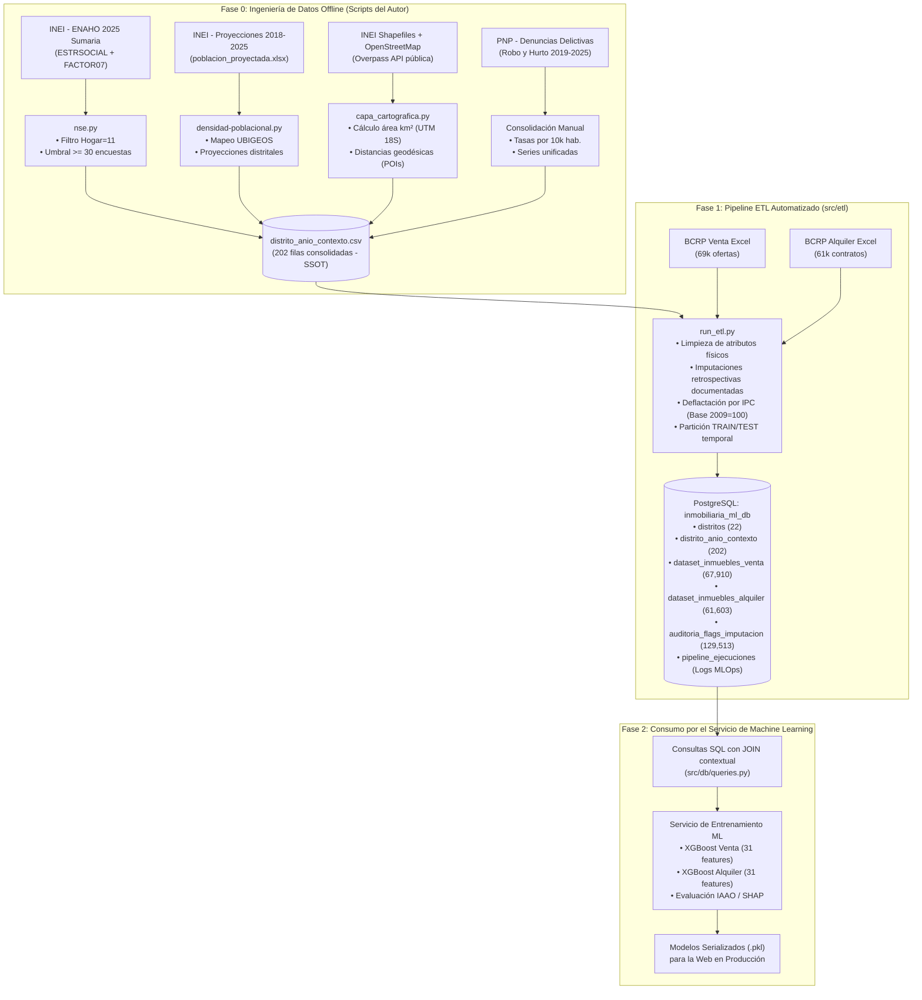

# Arquitectura de Ingesta, Procesamiento y Alimentación del Modelo

Este documento detalla el ciclo de vida completo de los datos en el proyecto de tesis: desde la **recolección offline de fuentes públicas heterogéneas**, pasando por el **Pipeline ETL automatizado hacia PostgreSQL**, hasta el **consumo analítico por el servicio de Machine Learning**.

---

## 1. Visión General del Flujo de Datos

El sistema distingue formalmente entre dos velocidades de datos: **Contexto Urbano (baja frecuencia / estático)** y **Transacciones Inmobiliarias (alta frecuencia / dinámico)**.



---

## 2. Fase 0: Extracción y Consolidación del Contexto Distrital (Scripts Especializados)

Para construir la capa socioeconómica, geográfica y de seguridad sin sobrecargar el pipeline en producción, se ejecutaron cuatro procesos de ingeniería de datos offline:

### 2.1. Nivel Socioeconómico — INEI / ENAHO ([`nse.py`](file:///d:/NuevaCarpetaLool/python_modelo_tesis/nse.py))
* **Fuente Primaria:** Base Sumaria de la Encuesta Nacional de Hogares (ENAHO 2025, INEI), archivo `Sumaria-2025.csv`.
* **Metodología Implementada:**
  1. Filtrado geográfico de Lima Metropolitana (`1501xx`) y Callao (`0701xx`).
  2. Filtrado de hogares principales (`HOGAR == 11`).
  3. Cálculo ponderado de la distribución de estratos socioeconómicos (`ESTRSOCIAL`: 1 al 5 $\rightarrow$ NSE A al E) utilizando el factor de expansión muestral oficial del INEI (`FACTOR07`).
  4. **Control de representatividad estadística:** Se impuso un umbral mínimo de **30 hogares encuestados** por distrito (`UMBRAL_MINIMO = 30`). Los distritos con muestra inferior quedaron marcados para el protocolo de imputación por afinidad socioeconómica y proximidad geográfica.

### 2.2. Demografía y Densidad — INEI ([`densidad-poblacional.py`](file:///d:/NuevaCarpetaLool/python_modelo_tesis/densidad-poblacional.py))
* **Fuente Primaria:** Proyecciones poblacionales distritales oficiales del INEI 2018–2025 (`poblacion_proyectada.xlsx`).
* **Metodología Implementada:**
  1. Normalización de nombres de distritos (remoción de tildes, mayúsculas, alias).
  2. Estandarización de códigos UBIGEO a 6 dígitos.
  3. Cálculo de la densidad habitacional anual dinámica:  
     $$\text{densidad\_hab\_km2}_{i, t} = \frac{\text{poblacion\_proyectada}_{d, t}}{\text{area\_distrito\_km2}_d}$$

### 2.3. Capa Cartográfica y Equipamiento Urbano — OpenStreetMap ([`capa_cartografica.py`](file:///d:/NuevaCarpetaLool/python_modelo_tesis/capa_cartografica.py))
* **Fuente Primaria:** Shapefiles cartográficos censales del INEI + API Overpass de OpenStreetMap (OSM).
* **Metodología Implementada:**
  1. Reproyección de geometrías a coordenadas proyectadas planas **UTM Zona 18S (EPSG:32718)** para cálculo exacto del área distrital en $\text{km}^2$ y centroides distritales.
  2. Consulta espacial con bounding box metropolitano `(-12.53, -77.22, -11.55, -76.58)` a través de mirrors públicos de Overpass API para extraer Puntos de Interés (POIs):
     * **Colegios:** `amenity=school`
     * **Hospitales y Clínicas:** `amenity=hospital`, `amenity=clinic`
     * **Transporte Masivo:** Estaciones de Metro de Lima (Línea 1) y Metropolitano (`railway=station`, `station=subway`, `highway=bus_stop`)
     * **Centros Comerciales:** `shop=mall`, `landuse=retail`
     * **Parques Urbanos:** `leisure=park`
     * **Universidades:** `amenity=university`, `amenity=college`
  3. Cálculo de distancias geodésicas mínimas y medianas (en km) desde el centroide de cada distrito hacia los POIs.

### 2.4. Seguridad Ciudadana — PNP (Consolidación Multianual)
* **Fuente Primaria:** Denuncias policiales por delitos contra el patrimonio registradas por la Policía Nacional del Perú (2019–2025).
* **Metodología Implementada:** Cálculo de tasas anuales estandarizadas de robo y hurto por cada 10,000 habitantes.

### Resultado de la Fase 0:
Toda esta información quedó consolidada en una única tabla maestra:  
👉 [`data/processed/distrito_anio_contexto.csv`](file:///d:/NuevaCarpetaLool/python_modelo_tesis/data/processed/distrito_anio_contexto.csv) (**202 registros**, cubriendo los 22 distritos modelados entre los años 2016 y 2025).

> **¿Por qué esta etapa NO se ejecuta en cada entrenamiento?**  
> Porque el equipamiento urbano (parques, hospitales, universidades) es estático y no cambia de ubicación cada mes, y las estadísticas de INEI/PNP se publican con periodicidad anual. Recalcular OSM y ENAHO en cada corrida saturaría APIs públicas externas e introduciría latencias de horas sin ningún beneficio analítico.

---

## 3. Fase 1: Ingesta Periódica y Carga a PostgreSQL (Servicio ETL)

Esta etapa es la que se ejecuta periódicamente (por ejemplo, cada trimestre cuando el BCRP publica nuevos reportes o se reciben nuevas ofertas de mercado).

### ¿Qué hace el orquestador [`src/etl/run_etl.py`](file:///d:/NuevaCarpetaLool/python_modelo_tesis/src/etl/run_etl.py)?
1. **Extracción:** Carga los archivos crudos de Excel del BCRP (`dataset_entrenamiento_venta_2025.xlsx` y `dataset_entrenamineto_alquiler_2025.xlsx`) y la tabla de contexto [`distrito_anio_contexto.csv`](file:///d:/NuevaCarpetaLool/python_modelo_tesis/data/processed/distrito_anio_contexto.csv).
2. **Transformación:**
   * Filtra los 22 distritos representativos comunes.
   * Aplica el protocolo de imputación documentado (NSE de Lince $\rightarrow$ Jesús María, Barranco $\rightarrow$ Miraflores, Magdalena $\rightarrow$ Pueblo Libre; Delitos 2016–2018 imputados desde 2019; Población 2016–2017 imputada desde 2018).
   * Imputa atributos físicos faltantes (mediana distrital para variables continuas, moda distrital para vista exterior).
   * Normaliza los montos a **Soles Constantes (IPC Base Diciembre 2009 = 100)**.
   * Asigna el split out-of-time: `TRAIN` (2016–2023) y `TEST` (2024–2025).
3. **Carga en PostgreSQL:**
   * Sincroniza la tabla dimensional `distritos` (22 registros).
   * Sincroniza `distrito_anio_contexto` (202 registros).
   * Inserta en bloque `dataset_inmuebles_venta` (67,910 filas) y `dataset_inmuebles_alquiler` (61,603 filas).
   * Guarda los flags en `auditoria_flags_imputacion` (129,513 registros) para auditoría científica.
   * Registra el log de duración y filas procesadas en `pipeline_ejecuciones`.

**Comando de ejecución:**
```bash
python -m src.etl.run_etl --run-all --truncate
```

---

## 4. Fase 2: Alimentación y Entrenamiento del Modelo (Servicio ML)

El servicio de Machine Learning queda completamente desacoplado de archivos locales. No lee Excels ni CSVs; consume los datos limpios directamente desde PostgreSQL mediante SQL analítico optimizado:

### 4.1. Conexión y Carga desde [`src/db/queries.py`](file:///d:/NuevaCarpetaLool/python_modelo_tesis/src/db/queries.py)

```python
from src.db.queries import load_training_dataset_venta, load_training_dataset_alquiler

# Carga directa del conjunto de entrenamiento de venta (Train 2016–2023)
df_train_venta = load_training_dataset_venta(split="TRAIN")
# Filas: 44,173 | Columnas: 31 features listas (físicas + contextuales con JOIN automático)

# Carga del conjunto de prueba out-of-time (Test 2024–2025)
df_test_venta = load_training_dataset_venta(split="TEST")
# Filas: 23,737 | Columnas: 31 features listas

# Carga para el modelo de alquiler
df_train_alquiler = load_training_dataset_alquiler(split="TRAIN") # 41,921 filas
df_test_alquiler  = load_training_dataset_alquiler(split="TEST")  # 19,682 filas
```

### 4.2. Consulta SQL Interna Ejecutada en PostgreSQL
PostgreSQL ejecuta el `JOIN` indexado entre la tabla transaccional y la tabla de contexto en menos de **100 milisegundos**:

```sql
SELECT 
    v.id AS inmueble_id,
    v.anio,
    v.trimestre,
    d.nombre AS distrito,
    v.superficie_m2,
    v.habitaciones,
    v.banos,
    v.garajes,
    v.piso,
    v.antiguedad_anios,
    v.vista_exterior,
    v.precio_soles_nominal,
    v.precio_soles_const,
    v.split_dataset,
    -- Variables Contextuales del Distrito y Año
    c.pct_nse_a, c.pct_nse_b, c.pct_nse_c, c.pct_nse_d, c.pct_nse_e,
    c.tasa_robo, c.tasa_hurto, c.tasa_denuncias,
    c.poblacion_proyectada, c.densidad_hab_km2,
    c.distancia_centro_km, c.dist_colegio_km, c.dist_hospital_km,
    c.dist_estacion_transporte_km, c.dist_centro_comercial_km,
    c.dist_parque_km, c.dist_universidad_km
FROM dataset_inmuebles_venta v
JOIN distritos d ON v.distrito_id = d.id
JOIN distrito_anio_contexto c ON v.distrito_id = c.distrito_id AND v.anio = c.anio
WHERE v.split_dataset = 'TRAIN'
ORDER BY v.anio ASC, v.trimestre ASC;
```

---

## 5. Protocolo de Mantenimiento Futuro

### Escenario A: Llegó un nuevo reporte trimestral del BCRP (ej. 2026-Q1)
1. Colocar el nuevo Excel en `data/raw/`.
2. Ejecutar:
   ```bash
   python -m src.etl.run_etl --target venta
   ```
3. PostgreSQL añade o refresca las observaciones de venta sin tocar los datos contextuales históricos.
4. El servicio ML se reentrena llamando a `load_training_dataset_venta()`.

### Escenario B: Se publicó una nueva ENAHO o informe de Criminalidad PNP (Anual)
1. Ejecutar el script offline correspondiente ([`nse.py`](file:///d:/NuevaCarpetaLool/python_modelo_tesis/nse.py) o consolidación PNP) para generar las 22 filas del nuevo año.
2. Añadir las filas a [`distrito_anio_contexto.csv`](file:///d:/NuevaCarpetaLool/python_modelo_tesis/data/processed/distrito_anio_contexto.csv).
3. Ejecutar `python -m src.etl.run_etl --run-all`.
4. PostgreSQL actualizará la tabla mediante `ON CONFLICT (distrito_id, anio) DO UPDATE` de forma transparente.
