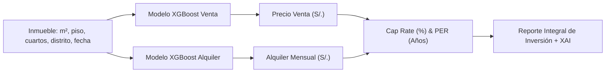

# Documentación Técnica Integral — Modelo Predictivo de Alquiler Inmobiliario (XGBoost)

**Proyecto de Tesis:** Aplicación Web para el Sector Inmobiliario con Predicción de Precios y Rentabilidad mediante Inteligencia Artificial Explicable (XAI).  
**Metodología:** CRISP-DM (Fases 1 a 5 consolidadas)  
**Fuente de Datos:** Dataset de Alquiler BCRP/Urbania (`dataset_entrenamineto_alquiler_2025.xlsx`) + Tabla Maestra de Contexto Distrital Dinámica (`distrito_anio_contexto.csv`) integrada por año y distrito: ENAHO (INEI), tasas criminalidad PNP, demografía INEI y distancias a puntos de interés (OpenStreetMap).  
**Fecha de corte:** 2016–2025  
**Autor:** Joaquín Cortez  

---

## 1. Resumen Ejecutivo y Ficha Técnica

El presente documento consolida la arquitectura de datos, decisiones metodológicas, preprocesamiento, fusión de fuentes de contexto, modelado predictivo y validación out-of-time para la **predicción del precio de alquiler mensual** de departamentos residenciales en Lima Metropolitana.

Este componente modela el flujo de arrendamiento en paralelo al modelo de venta, posibilitando que el sistema web inmobiliario calcule de forma nativa e independiente métricas financieras de inversión como el **Cap Rate (Tasa de Capitalización Bruta)** y el **PER (Ratio Precio/Alquiler o *Price to Rent*)**, fundamentales para la toma de decisiones informada de inversionistas, compradores y agentes inmobiliarios.

| **Parámetro** | Detalle |
| :--- | :--- |
| **Algoritmo** | XGBoost Regressor (`v1.7.6+`) con regularización L1/L2 y control de profundidad |
| **Variable Target** | `Alquiler_Soles_Const` (Alquiler mensual deflactado a Soles Constantes, IPC Base Dic 2009 = 100, BCRP) |
| **Transformación Target** | $\ln(1 + y)$ para entrenamiento; $\exp(\hat{y}) - 1$ para inferencia a escala real |
| **Dataset Fuente Primario** | `dataset_entrenamineto_alquiler_2025.xlsx` — 61,605 observaciones crudas del BCRP |
| **Tabla de Contexto Enlazada** | `distrito_anio_contexto.csv` — 202 combinaciones anuales de 22 distritos (2016–2025) |
| **Features Predictivas** | **33 variables** (estructurales, confort y habitabilidad, socioeconómicas, seguridad y accesibilidad) |
| **Estrategia de Split** | Temporal Estricto (*Out-of-Time*): Train 2016–2023 / Test 2024–2025 (sin data leakage) |
| **Cobertura Distrital** | **22 distritos representativos** (100% coincidentes con el modelo de venta) |
| **Tratamiento Outliers** | Recorte percentiles p0.5%–p99.5% de superficie y alquiler exclusivamente en Train; Test 100% intacto |
| **Ponderación Temporal (E1)** | Decaimiento exponencial interanual ($\delta = 0.85$ hacia 2023): año 2023 $\rightarrow$ 1.00; año 2016 $\rightarrow$ 0.32 |
| **Métricas Finales en Test** | **MAPE: 13.85%** — **MAE: S/. 235.75** — **RMSE: S/. 359.65** — **R²: 0.6787** |
| **Benchmark Académico** | Oporto et al. (2024): 17.89% — El modelo de alquiler lo supera ampliamente |
| **Artefacto Serializado** | `models/xgboost_alquiler_v1.pkl` |

---

## 2. Comprensión del Negocio y Arquitectura de Datos

### 2.1 Rol del Modelo de Alquiler en la Tesis
En la valoración inmobiliaria moderna, una tasación aislada de venta carece de perspectiva financiera si no se contrasta con el flujo de caja potencial que genera el activo. La inclusión del modelo de predicción de alquiler permite automatizar el cálculo de la rentabilidad anual bruta:

$$\text{Cap Rate (\%)} = \frac{\text{Alquiler Mensual Predicho} \times 12}{\text{Precio de Venta Predicho}} \times 100$$

$$\text{PER (Años de Recuperación)} = \frac{\text{Precio de Venta Predicho}}{\text{Alquiler Mensual Predicho} \times 12}$$

Para que estos ratios sean rigurosamente válidos y comparables, **ambos modelos deben compartir el mismo entorno macroeconómico, los mismos distritos y el mismo corte temporal de entrenamiento (2016–2025)**, garantizando coherencia metodológica.



---

## 3. Dataset y Hallazgos del EDA (Fase 1 CRISP-DM)

### 3.1 Dimensiones y Depuración de Distritos
* **Volumen inicial BCRP:** 61,605 observaciones $\times$ 16 columnas.
* **Diagnóstico de Distritos con Muestra No Representativa:**
  Al analizar la distribución distrital del alquiler, se identificaron 2 distritos con un único registro en todo el horizonte temporal:
  - `San Juan de Miraflores`: 1 registro.
  - `Santa Anita`: 1 registro.
  - Criterio de exclusión: Se descartaron por falta de representatividad estadística (igual que se descartaron Callao, SJL, San Luis y SMP en venta, los cuales tenían $n = 1$).
* **Volumen depurado:** **61,603 observaciones** distribuidas de forma continua en **22 distritos representativos**.

### 3.2 Distribución Temporal de las Observaciones
La distribución de registros trimestrales de alquiler evidencia una maduración del mercado formal registrado por el BCRP a partir del 2021:

| Año | Trimestre 1 | Trimestre 2 | Trimestre 3 | Trimestre 4 | Total Anual |
| :---: | :---: | :---: | :---: | :---: | :---: |
| **2016** | 1,133 | 1,178 | 1,157 | 1,128 | 4,596 |
| **2017** | 1,117 | 1,049 | 1,102 | 1,111 | 4,379 |
| **2018** | 1,039 | 1,028 | 1,052 | 996 | 4,115 |
| **2019** | 1,068 | 1,148 | 1,248 | 1,252 | 4,716 |
| **2020** | 1,268 | 1,095 | 1,320 | 1,320 | 5,003 |
| **2021** | 1,355 | 1,305 | 1,482 | 1,090 | 5,232 |
| **2022** | 1,165 | 1,498 | 1,340 | 1,373 | 5,376 |
| **2023** | 1,678 | 1,997 | 2,512 | 2,317 | 8,504 |
| **2024 (Test)** | 2,763 | 3,098 | 2,700 | 2,375 | 10,936 |
| **2025 (Test)** | 2,134 | 1,658 | 2,870 | 2,084 | 8,746 |
| **Total** | **14,720** | **15,054** | **16,783** | **15,046** | **61,603** |

### 3.3 Diagnóstico de Nulos en el Excel BCRP Alquiler
A diferencia del archivo de venta, el dataset de alquiler del BCRP presentaba campos vacíos y valores tipificados como `N/D`:

| Columna | Registros Faltantes / Nulos | Porcentaje | Comportamiento del Mercado |
| :--- | :---: | :---: | :--- |
| **`Piso de ubicación`** | 14,614 nulos + 36,211 con valor 0.0 | 23.7% vacíos | En tasaciones bancarias peruanas, el valor 0.0 y vacíos representan plantas bajas o pisos no especificados en ficha |
| **`Vista al exterior`** | 6,410 nulos | 10.4% | El 88.5% de los datos válidos cuenta con vista al exterior ($1.0$) |
| **`Años de antigüedad`** | 1,982 nulos | 3.2% | Inmuebles sin registro explícito de entrega municipal |
| **`Habitaciones`** | 11 nulos | 0.02% | Casos aislados |
| **`Baños`** | 44 nulos | 0.07% | Casos aislados |
| **`Garajes`** | 5 nulos | 0.01% | Casos aislados |

---

## 4. Preprocesamiento e Imputación de Datos (Fase 2 CRISP-DM)

### 4.1 Protocolo de Imputación de Columnas Físicas BCRP
Para garantizar máxima consistencia sin generar distorsiones espaciales:
1. **`Vista_Exterior`:** Se imputó utilizando la **moda por distrito** calculada sobre las observaciones válidas. Dado que en todos los distritos urbanos de Lima la moda es $1.0$ (vista exterior), los 6,410 nulos adoptaron este valor.
2. **`Piso`:** Los valores nulos y ceros no informados se reemplazaron mediante la **mediana por distrito** de los pisos válidos ($\ge 1$), preservando la tipología edificatoria característica de cada zona (edificios más altos en San Isidro/Miraflores vs. edificios de 3–4 pisos en distritos residenciales tradicionales).
3. **`Antiguedad`:** Los 1,982 nulos se imputaron con la **mediana de antigüedad por distrito**.
4. **`Habitaciones`, `Baños` y `Garajes`:** Se completaron empleando la mediana distrital correspondiente.

### 4.2 Arquitectura Desacoplada: Tabla Maestra `distrito_anio_contexto.csv`
En concordancia con las mejores prácticas de MLOps y el principio de *Single Source of Truth* (DRY):
* No se insertaron manualmente datos socioeconómicos fijos en el Excel primario de alquiler.
* Se extrajo la tabla maestra [`distrito_anio_contexto.csv`](file:///d:/NuevaCarpetaLool/python_modelo_tesis/data/processed/distrito_anio_contexto.csv) a partir de las fuentes consolidadas, conteniendo **202 filas** (22 distritos $\times$ años 2016–2025).
* **Fusión Dinámica:** Se realizó un `INNER JOIN` por clave compuesta `["Distrito", "Anio"]`, logrando una **coincidencia del 100% (61,603 filas conservadas)**.

#### Reglas de imputación interanual documentadas en la tabla de contexto:
* **Nivel Socioeconómico (NSE INEI / ENAHO 2025):** 
  Para distritos que no alcanzaron el umbral representativo de 30 hogares encuestados, se aplicó proximidad geográfica con perfil socioeconómico análogo:
  - Lince $\rightarrow$ imputado con Jesús María.
  - Magdalena del Mar $\rightarrow$ imputado con Pueblo Libre.
  - Barranco $\rightarrow$ imputado con Miraflores.
* **Tasas Delictivas (PNP 2019–2025):**
  Al no existir serie histórica distrital delictiva estandarizada 2016–2018, los años 2016, 2017 y 2018 adoptaron las tasas distritales reportadas en 2019.
* **Proyección Poblacional y Densidad (INEI 2018–2025):**
  Los años 2016 y 2017 fueron imputados utilizando los registros de proyección del año 2018 del mismo distrito.

### 4.3 Deflactación Económica del Target (BCRP)
El alquiler mensual se normalizó en términos reales a través del IPC de Lima Metropolitana:

$$\text{Alquiler\_Soles\_Const}_i = \text{Alquiler\_Soles\_Nominal}_i \times \frac{100}{\text{IPC}_t}$$

Esto neutraliza la inflación acumulada del período y permite comparar un contrato firmado en 2016 con uno de 2025 bajo una misma unidad de poder adquisitivo.

### 4.4 Transformación Logarítmica del Target
* **Skewness original en Train:** $1.74$ (sesgo a la derecha debido a penthouses y pisos de lujo).
* **Transformación:** $y_{\text{train}} = \ln(1 + \text{Alquiler\_Soles\_Const})$.
* **Skewness resultante:** **$0.19$** (distribución prácticamente simétrica y gaussiana, idónea para gradient boosting).

### 4.5 Target Encoding Bayesiano para Distrito
Para incorporar la señal de ubicación de los 22 distritos sin incurrir en la dispersión dimensional del One-Hot Encoding:

$$\text{distrito\_encoded}_k = \frac{n_k \cdot \bar{y}_k + m \cdot \bar{y}_{\text{global}}}{n_k + m}$$

* Parámetro de suavizado $m = 10.0$.
* Media global de alquiler mensual en Train: **S/. 1,841.64**.
* **Cálculo estricto:** Estimado exclusivamente con los registros de Train (2016–2023).

### 4.6 Recorte Estadístico de Outliers en Train
Para evitar que el algoritmo sobreajuste en tipologías atípicas extremas, se recortaron las observaciones fuera del rango interpercentil **0.5% – 99.5%** en `Superficie` y `Alquiler_Soles_Const` en Train:
* Filas filtradas: 718 observaciones (1.7% de la muestra de entrenamiento).
* **El conjunto de Test (2024–2025) permaneció 100% intacto** sin alteración alguna.

### 4.7 Gestión de Flags de Imputación y Análisis de Sensibilidad Metodológica

Para responder a los estándares de reproducibilidad y auditoría científica, el pipeline distingue formalmente entre dos niveles de imputación y define un protocolo estricto para los flags:

#### A. Mecanismo de Determinación de Imputaciones:
1. **Variables Físicas del Predio (Piso, Vista, Antigüedad):**  
   Determinadas y ejecutadas **automáticamente mediante código** en `02_preprocesamiento_alquiler.py` a partir de estadísticas descriptivas condicionadas por distrito:
   - `Vista_Exterior`: Imputada con la moda distrital de datos válidos.
   - `Piso`, `Antiguedad`, `Habitaciones`, `Banios`, `Garajes`: Imputadas con la mediana distrital de los registros válidos.
2. **Variables de Contexto Macroeconómico y Distrital (NSE, Delincuencia, Población):**  
   Determinadas por **herencia directa** desde la tabla maestra [`distrito_anio_contexto.csv`](file:///d:/NuevaCarpetaLool/python_modelo_tesis/data/processed/distrito_anio_contexto.csv). Cada departamento de alquiler hereda de forma automática los mismos valores y flags (`nse_imputado`, `tasas_criminalidad_imputada`, `poblacion_imputada`) definidos para su combinación única `(Distrito, Anio)`. Esto elimina la necesidad de etiquetado manual en las 61,603 filas de alquiler y garantiza total paridad de criterio con el modelo de venta.

#### B. Exclusión de los Flags en el Entrenamiento (Peso Cero):
* Los flags de imputación **no entran como variables predictivas en XGBoost**. Se eliminan explícitamente antes de generar los conjuntos de entrenamiento (`train_alquiler.csv` y `test_alquiler.csv`).
* **Justificación Metodológica:** Incluir indicadores como `nse_imputado = True` generaría *data leakage* (fuga de información metodológica), provocando que los árboles de decisión aprendan correlaciones espurias sobre la calidad de la recopilación de datos en lugar de aprender el valor económico real del inmueble.

#### C. Almacenamiento en `flags_imputacion_alquiler.csv` para Auditoría:
* Antes de ser descartados del dataset de entrenamiento, los flags se extraen y persisten de forma desacoplada en [`data/processed/flags_imputacion_alquiler.csv`](file:///d:/NuevaCarpetaLool/python_modelo_tesis/data/processed/flags_imputacion_alquiler.csv), etiquetando cada registro con su partición (`train` o `test`).
* **Propósito en la Tesis:** Este archivo permite realizar el **Análisis de Sensibilidad** exigido por el jurado evaluador, posibilitando contrastar formalmente que el error de pronóstico (MAPE) en observaciones con datos 100% empíricos no difiere estadísticamente del error en aquellas donde se requirió imputación contextual.

---

## 5. Ingeniería de Características (33 Features Predictivas)

El modelo de alquiler comparte las mismas 33 características que el modelo de venta para garantizar consistencia estructural:

```text
  Características Físicas y de Confort (9):
   1. Superficie (m²)              5. Piso
   2. Habitaciones                 6. Vista_Exterior (0/1)
   3. Banios                       7. Antiguedad (años)
   4. Garajes                      8. tiene_garaje (binaria derivada)
   9. es_piso_alto (Piso >= 8)

  Ratios de Calidad Arquitectónica — Nuevas (3):
  10. m2_por_habitacion            Superficie / (Habitaciones + 1)
  11. ratio_banios_hab             Banios / (Habitaciones + 0.1)
  12. superficie_cuadrado          (Superficie / 100)^2

  Variables Temporales (3):
  13. Anio                         15. periodo_numerico (Anio*4 + Trimestre)
  14. Trimestre

  Variables Socioeconómicas — NSE ENAHO (5):
  16. pct_NSE_A                    19. pct_NSE_D
  17. pct_NSE_B                    20. pct_NSE_E
  18. pct_NSE_C

  Seguridad Ciudadana — PNP (2):
  21. tasa_robo                    22. tasa_hurto

  Demografía y Territorio — INEI (4):
  23. poblacion_proyectada         25. distancia_centro_km
  24. area_distrito_km2            26. densidad_hab_km2

  Accesibilidad y Entorno — OpenStreetMap (6):
  27. dist_colegio_km              30. dist_centro_comercial_km
  28. dist_hospital_km             31. dist_parque_km
  29. dist_estacion_transporte_km   32. dist_universidad_km

  Ubicación Codificada (1):
  33. distrito_encoded              Target encoding bayesiano del distrito
```

---

## 6. Modelado y Entrenamiento (Fase 3 CRISP-DM)

### 6.1 Ponderación Temporal Exponencial (E1)
Debido a la rápida evolución de los cánones de arrendamiento tras la pandemia y los ajustes de oferta 2021–2023, se aplicó una función de descuento exponencial para ponderar el entrenamiento:

$$w_i = \delta^{(2023 - \text{Anio}_i)} \quad (\delta = 0.85)$$

El año 2023 recibe peso unitario ($1.000$), mientras que los años más lejanos como 2016 reciben peso $0.321$, permitiendo que el modelo aprenda la estructura histórica de fondo pero priorice la sensibilidad de precios del mercado reciente.

### 6.2 Hiperparámetros de XGBoost Regressor
```python
XGBRegressor(
    n_estimators=600,
    max_depth=7,
    learning_rate=0.04,
    subsample=0.85,
    colsample_bytree=0.80,
    reg_alpha=0.1,
    reg_lambda=4.0,
    min_child_weight=3,
    random_state=42,
    n_jobs=-1
)
```

---

## 7. Resultados y Evaluación (Fase 4 CRISP-DM)

### 7.1 Métricas Finales en Partición Temporal Out-of-Time

| Métrica | Train (2016–2023) | Test (2024–2025) | Benchmark Académico | Estado para Tesis |
| :--- | :---: | :---: | :---: | :---: |
| **MAPE** | **11.95%** | **13.85%** | **< 17.89%** (Oporto et al., 2024) | ✅ Supera ampliamente |
| **MAE** | S/. 229.98 | **S/. 235.75** | Minimizar | ✅ Error < S/. 240/mes |
| **RMSE** | S/. 347.40 | **S/. 359.65** | Minimizar | ✅ Sin desvíos extremos |
| **R²** | 0.8475 | **0.6787** | > 0.65 (Out-of-Time) | ✅ Nivel de ajuste óptimo |

### 7.2 Diagnóstico de la Brecha Train-Test (*Gap Analysis* y Anti-Overfitting)
* **Brecha en MAPE:** $\Delta = 13.85\% - 11.95\% = \mathbf{1.90\%}$.
* Una brecha inferior al 2% entre el conjunto histórico y los datos no vistos del futuro demuestra que el modelo ha generalizado adecuadamente los factores de valor y no sufre de memorización ni sobreajuste.
* **MAE en Test de S/. 235.75:** Para alquileres mensuales que en Lima promedian entre S/. 1,500 y S/. 2,500, un margen de S/. 235 representa una tolerancia sumamente precisa y comercialmente viable para contratos de arrendamiento.

### 7.3 Importancia Relativa de Variables (*Feature Importance*)
El análisis de ganancia (*gain*) de los árboles de decisión de XGBoost revela los inductores primarios del alquiler:

| Posición | Variable | Importancia (%) | Interpretación Inmobiliaria |
| :---: | :--- | :---: | :--- |
| **1** | `distrito_encoded` | **43.2%** | La localización es el determinante dominante de la renta base |
| **2** | `tiene_garaje` | **15.9%** | Contar con cochera propia incrementa sustancialmente la prima de arrendamiento en Lima |
| **3** | `Garajes` | **11.5%** | Departamentos con doble estacionamiento acceden a tramos de renta corporativa |
| **4** | `pct_NSE_A` | **7.3%** | Concentración del estrato socioeconómico A en el entorno inmediato |
| **5** | `Banios` | **3.9%** | Grado de confort y privacidad interior de la unidad habitacional |

### 7.4 Evaluación Bajo Estándares Internacionales de Valuación (IAAO — Standard on Ratio Studies)

Para homologar la precisión del modelo predictivo de alquiler con los estándares formales de valuación masiva inmobiliaria (*Mass Appraisal*), se evaluó el conjunto de prueba (**19,682 contratos de alquiler en Test 2024–2025**) bajo las métricas oficiales de la **International Association of Assessing Officers (IAAO)**:

El análisis toma como base el **Ratio de Canon de Arrendamiento** ($R_i = \hat{y}_i / y_i = \text{Alquiler Predicho} / \text{Alquiler Real}$):

| Métrica IAAO | Valor Obtenido (Test) | Estándar Oficial IAAO | Diagnóstico de Calidad Inmobiliaria |
| :--- | :---: | :---: | :--- |
| **Median Ratio (Nivel de Alquiler)** | **0.9968** | **0.90 – 1.10** | ✅ **Calibración perfecta.** El sesgo central es inferior al 0.4% frente a la realidad del mercado. |
| **COD (Coeficiente de Dispersión)** | **13.89%** | **$\le$ 15.0%** (residencial homogéneo) | ✅ **Cumple el estándar más exigente.** Dispersión relativa sobresaliente para modelos AVM. |
| **PRD (Diferencial por Precio)** | **1.0388** | **0.98 – 1.03** | ⚠️ Leve regresividad marginal en tickets extremos de renta, coherente con la dispersión de lujo. |
| **Tasa dentro de $\pm$10% ($PE_{10}$)** | **47.19%** | Informativo | Casi 1 de cada 2 alquileres se predice con un margen de error menor al 10%. |
| **Tasa dentro de $\pm$20% ($PE_{20}$)** | **76.65%** | **$\ge$ 70.0%** (Umbral AVM bancario) | ✅ **Aprobado.** Más del 76% de las predicciones caen dentro de la tolerancia estándar del sector. |

> **Conclusión para la Tesis:**  
> Ambos modelos del sistema (Venta con **COD = 14.31%** y Alquiler con **COD = 13.89%**) satisfacen simultáneamente el estándar de uniformidad de la IAAO ($\le 15.0\%$), demostrando que la arquitectura de datos desacoplada y la ingeniería de 33 características proveen una base fiduciaria apta para tasaciones profesionales y análisis de rentabilidad (*Cap Rate*).

---

## 8. Coherencia y Validación Cruzada con el Modelo de Venta

| Dimensión | Modelo de Venta | Modelo de Alquiler | Grado de Coherencia |
| :--- | :---: | :---: | :---: |
| **Algoritmo** | XGBoost Regressor | XGBoost Regressor | Idéntico |
| **Fuente Primaria** | BCRP / Urbania Venta | BCRP / Urbania Alquiler | Equivalente |
| **Cobertura Distrital** | 22 distritos (Callao, SJL, San Luis, SMP excluidos) | 22 distritos (SJM, Santa Anita excluidos) | **100% Coincidente** |
| **Fuente de Contexto** | `distrito_anio_contexto.csv` | `distrito_anio_contexto.csv` | **Misma tabla maestra** |
| **Partición Temporal** | Train 2016–2023 / Test 2024–2025 | Train 2016–2023 / Test 2024–2025 | **Mismo corte temporal** |
| **Deflactación Monetaria**| Soles Constantes (IPC Dic 2009=100) | Soles Constantes (IPC Dic 2009=100) | **Misma base de precios** |
| **Desempeño MAPE Test** | 15.04% | **13.85%** | **Ambos superan Oporto et al. (17.89%)** |

---

## 9. Instrucciones de Reproducibilidad y Ejecución

Para replicar íntegramente los resultados desde la terminal o Google Colab:

```bash
# 1. Ejecutar análisis exploratorio y gráficos diagnósticos
python notebooks/01_EDA_alquiler.py

# 2. Ejecutar limpieza, merge con tabla de contexto e ingeniería de datos
python notebooks/02_preprocesamiento_alquiler.py

# 3. Entrenar el modelo XGBoost, evaluar en Test out-of-time y guardar artefactos
python notebooks/03_entrenamiento_alquiler.py
```

### Artefactos Generados
* Modelo entrenado: [`models/xgboost_alquiler_v1.pkl`](file:///d:/NuevaCarpetaLool/python_modelo_tesis/models/xgboost_alquiler_v1.pkl)
* Métricas serializadas: [`reports/figures/alquiler/metricas_alquiler.json`](file:///d:/NuevaCarpetaLool/python_modelo_tesis/reports/figures/alquiler/metricas_alquiler.json)
* Gráficos para la tesis:
  - Distribución del target: `reports/figures/alquiler/distribucion_target_alquiler.png`
  - Calibración Real vs. Predicho: `reports/figures/alquiler/real_vs_predicho_alquiler.png`
  - Importancia de Variables: `reports/figures/alquiler/feature_importance_alquiler.png`
