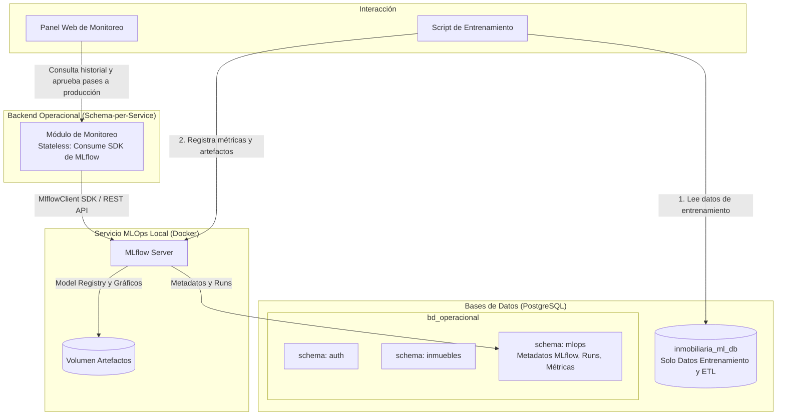

# Guía Práctica: Entrenamiento del Modelo de Machine Learning desde PostgreSQL

Esta guía documenta la interacción con las tablas de la base de datos centralizada **PostgreSQL** (`inmobiliaria_ml_db`), las consideraciones metodológicas para el entrenamiento del modelo de ML, la clarificación sobre artefactos SHAP y el mapeo arquitectónico futuro de MLOps.

---

## 1. Tablas de la Base de Datos: Cuáles se Consumen y Cómo

La base de datos `inmobiliaria_ml_db` cuenta con **6 tablas**, organizadas para separar los datos analíticos del control de calidad y auditoría:

| Tabla en `inmobiliaria_ml_db` | ¿Se consume para entrenar? | Rol en el Proceso |
| :--- | :---: | :--- |
| **`dataset_inmuebles_venta`** | **SÍ** | Registros de transacciones de venta (superficie, cuartos, baños, garajes, piso, precio, `split_dataset`). |
| **`dataset_inmuebles_alquiler`** | **SÍ** | Registros de transacciones de alquiler (mismo esquema para el modelo de renta). |
| **`distritos`** | **SÍ** | Catálogo oficial de distritos (nombre, ubigeo). |
| **`distrito_anio_contexto`** | **SÍ** | Variables macro, NSE (INEI), seguridad (PNP), demografía y distancias cartográficas a POIs (OSM) por distrito y año. |
| **`auditoria_flags_imputacion`** | **NO** | Solo para auditoría de calidad de datos (registra qué campos fueron imputados por KNN/Moda/Mediana). |
| **`pipeline_ejecuciones`** | **NO** | Solo para control de ingesta y ETL (registra fecha, estado, autor y filas procesadas del pipeline de datos). |

### ¿Cómo se unen las tablas para entrenar? (El JOIN Contextual)

En lugar de consultar tablas sueltas, el script de entrenamiento consume una vista o consulta con `JOIN` que combina las características físicas del inmueble con el contexto distrital del año exacto en que ocurrió la transacción:

```sql
SELECT 
    v.id AS inmueble_id,
    v.anio,
    v.trimestre,
    d.nombre AS distrito,
    v.superficie_m2,
    v.habitaciones,
    v.banos,
    v.garajes,
    v.piso,
    v.antiguedad_anios,
    v.vista_exterior,
    v.precio_soles_nominal,
    v.precio_soles_const,
    v.split_dataset,
    -- Variables Contextuales Anuales (JOIN)
    c.pct_nse_a, c.pct_nse_b, c.pct_nse_c, c.pct_nse_d, c.pct_nse_e,
    c.tasa_robo, c.tasa_hurto, c.tasa_denuncias,
    c.poblacion_proyectada, c.densidad_hab_km2,
    c.distancia_centro_km, c.dist_colegio_km, c.dist_hospital_km,
    c.dist_estacion_transporte_km, c.dist_centro_comercial_km,
    c.dist_parque_km, c.dist_universidad_km
FROM dataset_inmuebles_venta v
JOIN distritos d 
    ON v.distrito_id = d.id
JOIN distrito_anio_contexto c 
    ON v.distrito_id = c.distrito_id AND v.anio = c.anio
WHERE v.split_dataset = 'TRAIN'  -- O 'TEST'
ORDER BY v.anio ASC, v.trimestre ASC;
```

Esta consulta ya se encuentra encapsulada y optimizada en:
```python
from src.db.queries import load_training_dataset_venta, load_training_dataset_alquiler

df_train = load_training_dataset_venta(split="TRAIN")
df_test  = load_training_dataset_venta(split="TEST")
```

---

## 2. Aspectos Clave a Considerar al Entrenar desde la Base de Datos

### A. Variables de Entorno y Conexión
Asegúrate de que la rama o entorno donde ejecutarás el entrenamiento tenga acceso al archivo `.env` configurado con las credenciales de PostgreSQL:
```env
DB_HOST=localhost
DB_PORT=5432
DB_NAME=inmobiliaria_ml_db
DB_USER=postgres
DB_PASSWORD=tu_password
```

---

### B. Respetar el Split Temporal (Evitar *Data Leakage*)
En series temporales de bienes raíces, **nunca se debe hacer un `train_test_split` aleatorio**, pues generaría fuga temporal (*Look-ahead bias*).
* La columna **`split_dataset`** ya viene particionada desde la base de datos:
  * `'TRAIN'`: Años 2016 a 2023 (~80% de los datos).
  * `'TEST'`: Años 2024 a 2025 (~20% de los datos).

---

### C. Variable Objetivo (*Target*) y Escala Logarítmica
* **Target a predecir:** `precio_soles_const` (precios en soles constantes ajustados por IPC base Dic 2009).
  * *Justificación de tesis:* El precio nominal arrastra inflación histórica. Al predecir sobre soles constantes, el modelo aprende el valor económico real del metro cuadrado y del inmueble.
* **Transformación matemática:**
  * Entrenamiento: `y_train = np.log1p(df_train["precio_soles_const"])`
  * Evaluación de métricas e inferencia real: `y_pred_real = np.expm1(y_pred_log)`

---

### D. Consistencia de *Features* (Training-Serving Parity)
Para que el modelo entrenado sea 100% compatible con la API de inferencia (`ml-service`), las columnas derivadas deben construirse con idéntica lógica:

1. **Features Base del Inmueble:**
   * `superficie_m2`, `habitaciones`, `banos`, `garajes`, `piso`, `antiguedad_anios`, `vista_exterior`.
2. **Features Temporales y de Ingeniería:**
   * `periodo_numerico = anio * 4 + trimestre`
   * `m2_por_habitacion = superficie_m2 / (habitaciones + 1)`
   * `ratio_banios_hab = banos / (habitaciones + 0.1)`
   * `tiene_garaje = (garajes > 0).astype(float)`
   * `es_piso_alto = (piso >= 8).astype(float)`
   * `superficie_cuadrado = (superficie_m2 / 100) ** 2`
3. **Features de Contexto Distrital (Vienen del JOIN con `distrito_anio_contexto`):**
   * NSE: `pct_nse_a`, `pct_nse_b`, `pct_nse_c`, `pct_nse_d`, `pct_nse_e`.
   * Seguridad: `tasa_robo`, `tasa_hurto`.
   * Demografía: `densidad_hab_km2`, `poblacion_proyectada`.
   * Distancias POI: `distancia_centro_km`, `dist_colegio_km`, `dist_hospital_km`, `dist_estacion_transporte_km`, `dist_centro_comercial_km`, `dist_parque_km`, `dist_universidad_km`.
4. **Encoding del Distrito (`distrito_encoded`):**
   * Si usas Target Encoding o Mapeo Ordinal ordenado por mediana de precio, **guarda el diccionario resultante en `model_config.json`**. El servicio de inferencia necesita ese mismo diccionario para codificar las nuevas solicitudes.

---

### E. Delimitación de Responsabilidades: `pipeline_ejecuciones`
* **Regla estricta:** La tabla `pipeline_ejecuciones` en `inmobiliaria_ml_db` pertenece **única y exclusivamente al pipeline de datos (ETL)**: ingesta de excels BCRP, actualización del contexto distrital, control de imputaciones y volumen de filas procesadas.
* El entrenamiento y evaluación de modelos **NO debe sobrecargar esta tabla**. En la fase actual, los resultados de entrenamiento se persisten en artefactos (`.json` y `.pkl`).

---

## 3. ¿Es Necesario Guardar un Artefacto `shap_explainer.pkl`?

**NO, no es necesario guardar un archivo `.pkl` del Explainer.**

### ¿Cómo funciona en `ml-service` y tu aplicación web?
1. **Inicialización en memoria al startup:** En `app/core/model_loader.py`, cuando la API de FastAPI arranca, carga el modelo serializado `xgboost_venta_v2.pkl` y crea el TreeExplainer en memoria:
   ```python
   state.modelo = joblib.load(model_path)
   state.explainer = shap.TreeExplainer(state.modelo)  # Tarda solo ~500ms al iniciar
   ```
2. **Inferencia en tiempo real:** Cuando el usuario consulta el precio de un departamento desde la aplicación web:
   * El servicio predice el precio.
   * Ejecuta `shap_vals = state.explainer.shap_values(X)` en milisegundos (< 15 ms).
   * La respuesta JSON del endpoint `/predict` devuelve **en la misma llamada** tanto el precio estimado con su intervalo como el desglose SHAP de impacto por variable (`explicabilidad.contribuciones`).
3. **¿Por qué NO serializar el Explainer en disco?**
   * Serializar `TreeExplainer` con `pickle`/`joblib` suele provocar problemas de compatibilidad binaria entre versiones de SHAP y Numba.
   * Al reconstruirse directamente en RAM a partir del modelo `XGBRegressor`, no requiere archivo adicional y es 100% confiable.

---

## 4. Artefactos Oficiales a Exportar tras el Re-entrenamiento

Al terminar el entrenamiento, únicamente necesitas exportar y actualizar los siguientes archivos consumidos por `ml-service`:

| Artefacto | Ubicación | Descripción |
| :--- | :--- | :--- |
| **Modelo Serializado** | `models/xgboost_venta_v2.pkl` | Binario entrenado con XGBoost. |
| **Hiperparámetros** | `models/xgboost_venta_v2_params.json` | Parámetros óptimos seleccionados. |
| **Métricas Oficiales** | `models/xgboost_venta_v2_metricas.json` | MAE, RMSE, MAPE y R² en Test. |
| **Config del Servicio** | `ml-service/config/model_config.json` | Lista ordenada de `feature_cols`, mapeo `distrito_encoded`, e IPC vigente. |

---

## 5. Criterios de Aprobación de la Tesis (Benchmarks)

Para considerar el modelo apto para la tesis y producción:
* **Benchmark Referencial (Oporto et al., 2024):** $\text{MAPE} < 15\%$.
* **Estándar Internacional IAAO (Evaluación Masiva de Inmuebles):** $\text{MAPE} \le 10\%$.
* **Coeficiente de Determinación ($R^2$):** $R^2 \ge 0.85$ en el conjunto de prueba (2024–2025).

---

## 6. Mapeo Arquitectónico Futuro: MLOps Tracking y Monitoreo

Aunque la configuración e instalación de la infraestructura de MLOps tracking (MLflow en Docker) se abordará en una etapa posterior, queda definido el diseño arquitectónico de integración bajo el patrón **Schema-per-Service**:



### Principios del Mapeo MLOps:
1. **Schema Dedicado (`bd_operacional.mlops`):** En lugar de crear una base de datos física separada, se aprovecha la base de datos operacional creando un schema exclusivo `mlops` (siguiendo el patrón *Schema-per-Service*). MLflow apuntará a este schema mediante su cadena de conexión (`search_path=mlops`).
2. **Aislamiento de `inmobiliaria_ml_db`:** La base de datos de entrenamiento se mantiene 100% limpia y orientada únicamente a datos de inmuebles, contexto distrital y control ETL de ingesta.
3. **Módulo de Monitoreo Stateless en Backend:** El módulo de monitoreo del backend operacional no necesita diseñar tablas manuales de métricas ni versiones; consulta a MLflow mediante el cliente SDK (`MlflowClient`) o REST API.
4. **Pase a Producción Controlado:** Desde la interfaz web de administración, el usuario/administrador visualiza las métricas y puede promover versiones del modelo (`Staging` $\rightarrow$ `Production`). El servicio de inferencia `ml-service` consume de forma transparente el modelo que se encuentre activo en producción.
