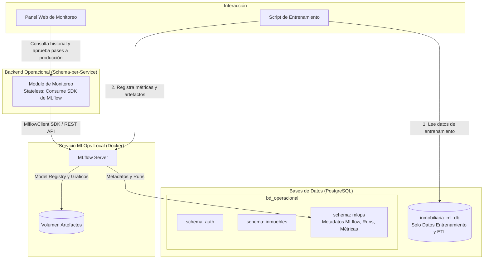

# Guía Práctica: Entrenamiento del Modelo de Machine Learning desde PostgreSQL

Esta guía documenta la interacción con las tablas de la base de datos centralizada **PostgreSQL** (`inmobiliaria_ml_db`), el mapeo 1-a-1 de las 33 features del modelo, la clarificación sobre artefactos SHAP y el diseño arquitectónico de MLOps.

---

## 1. Tablas de la Base de Datos: Cuáles se Consumen y Cómo

La base de datos `inmobiliaria_ml_db` cuenta con **6 tablas**, organizadas para separar los datos analíticos del control de calidad y auditoría:

| Tabla en `inmobiliaria_ml_db` | ¿Se consume para entrenar? | Rol en el Proceso |
| :--- | :---: | :--- |
| **`dataset_inmuebles_venta`** | **SÍ** | Registros de transacciones de venta (superficie, cuartos, baños, garajes, piso, precio, `split_dataset`). |
| **`dataset_inmuebles_alquiler`** | **SÍ** | Registros de transacciones de alquiler (mismo esquema para el modelo de renta). |
| **`distritos`** | **SÍ** | Catálogo oficial de los 22 distritos modelados (nombre, ubigeo, `area_km2`). |
| **`distrito_anio_contexto`** | **SÍ** | Variables macro, NSE (INEI), seguridad (PNP), demografía (`area_distrito_km2`, densidad) y distancias cartográficas a POIs (OSM) por distrito y año. |
| **`auditoria_flags_imputacion`** | **NO** | Solo para auditoría de calidad de datos (registra qué campos fueron imputados por KNN/Moda/Mediana). |
| **`pipeline_ejecuciones`** | **NO** | Solo para control de ingesta y ETL (registra fecha, estado, autor y filas procesadas del pipeline de datos). |

### ¿Cómo se unen las tablas para entrenar? (El JOIN Contextual)

El script de entrenamiento consume una consulta con `JOIN` que combina las características físicas del departamento con el contexto distrital del año exacto en que ocurrió la transacción:

```sql
SELECT 
    v.id AS inmueble_id,
    v.anio,
    v.trimestre,
    d.nombre AS distrito,
    v.superficie_m2,
    v.habitaciones,
    v.banos,
    v.garajes,
    v.piso,
    v.antiguedad_anios,
    v.vista_exterior,
    v.precio_soles_nominal,
    v.precio_soles_const,
    v.split_dataset,
    -- Variables Contextuales Anuales (JOIN)
    c.pct_nse_a, c.pct_nse_b, c.pct_nse_c, c.pct_nse_d, c.pct_nse_e,
    c.tasa_robo, c.tasa_hurto, c.tasa_denuncias,
    c.poblacion_proyectada, c.area_distrito_km2, c.densidad_hab_km2,
    c.distancia_centro_km, c.dist_colegio_km, c.dist_hospital_km,
    c.dist_estacion_transporte_km, c.dist_centro_comercial_km,
    c.dist_parque_km, c.dist_universidad_km
FROM dataset_inmuebles_venta v
JOIN distritos d 
    ON v.distrito_id = d.id
JOIN distrito_anio_contexto c 
    ON v.distrito_id = c.distrito_id AND v.anio = c.anio
WHERE v.split_dataset = 'TRAIN'  -- O 'TEST'
ORDER BY v.anio ASC, v.trimestre ASC;
```

Esta consulta se encuentra encapsulada en Python y probada:
```python
from src.db.queries import load_training_dataset_venta, load_training_dataset_alquiler

df_train = load_training_dataset_venta(split="TRAIN")
df_test  = load_training_dataset_venta(split="TEST")
```

### 1.1. Cobertura Geográfica: 22 Distritos Comunes vs Exclusiones BCRP ($n=1$)

* **En Venta (`dataset_entrenamiento_venta_2025.xlsx`):** 26 distritos crudos (69,636 filas).
  * Los **22 distritos modelados** representan 69,632 filas (**99.994%** del total).
  * 4 distritos atípicos con solo **1 observación** en 10 años ($n=1$): *Callao Cercado, San Juan de Lurigancho, San Luis, San Martín de Porres*.
* **En Alquiler (`dataset_entrenamineto_alquiler_2025.xlsx`):** 24 distritos crudos (61,605 filas).
  * Los **22 distritos modelados** representan 61,603 filas (**99.997%** del total).
  * 2 distritos atípicos con solo **1 observación** en 10 años ($n=1$): *San Juan de Miraflores, Santa Anita*.
* **Criterio de Alineación para Rentabilidad:** Al enfocar el modelo en los **mismos 22 distritos comunes**, se garantiza que cualquier inmueble tasado pueda proyectar tanto su precio de venta como su canon de alquiler, permitiendo calcular el retorno de inversión (*Gross Rental Yield* / *Cap Rate*) sin inconsistencias de cobertura.

### 1.2. Protocolo de Imputaciones Socioeconómicas (NSE - ENAHO 2025)

El cálculo de estratos socioeconómicos (NSE A al E) utiliza la Encuesta Nacional de Hogares (ENAHO Sumaria 2025) con factor de expansión muestral (`FACTOR07`) y un umbral mínimo de representatividad de **30 hogares encuestados**:
* **Distritos con Muestra Propia Robusta:** Distritos con $\ge 30$ hogares encuestados se calculan directamente.
  * **Caso Especial Ate Vitarte:** En la base ENAHO oficial figura como `Ate` (UBIGEO `150103`) con **194 hogares encuestados**. No requirió imputación artificial; cuenta con sus porcentajes reales oficiales: **A: 1.33%, B: 5.60%, C: 14.35%, D: 53.18%, E: 25.53%** con `nse_imputado = False`.
* **Protocolo de "Distrito Hermano Socioeconómico y Urbano" (Muestra $<30$ hogares):**
  Para evitar sesgos por contigüidad puramente geométrica, los distritos con muestra censal insuficiente se imputaron con vecinos de idéntico perfil residencial e inmobiliario:
  * **Lince $\rightarrow$ Jesús María:** Ambos distritos consolidados de Lima Moderna con perfil socioeconómico medio B/C *(se descartó San Isidro por tener un perfil predominantemente A/B que sobrestimaría a Lince)*.
  * **Barranco $\rightarrow$ Miraflores:** Ambos distritos del eje costero de Lima Top con perfil predominante A/B.
  * **Magdalena $\rightarrow$ Pueblo Libre:** Ambos distritos tradicionales de Lima Moderna con perfil medio B/C.

---

## 2. Verificación de las 33 Features del Modelo (Training-Serving Parity)

El modelo en producción (`ml-service`) requiere exactamente **33 variables**, las cuales están 100% cubiertas entre la base de datos y el preprocesamiento:

### A. 26 Variables Base (Cargadas directamente de PostgreSQL):
| Feature en Modelo (`ml-service`) | Columna en PostgreSQL | Origen de Datos |
| :--- | :--- | :--- |
| `Anio` | `v.anio` | Inmuebles BCRP |
| `Trimestre` | `v.trimestre` | Inmuebles BCRP |
| `Superficie` | `v.superficie_m2` | Inmuebles BCRP |
| `Habitaciones` | `v.habitaciones` | Inmuebles BCRP |
| `Banios` | `v.banos` | Inmuebles BCRP |
| `Garajes` | `v.garajes` | Inmuebles BCRP |
| `Piso` | `v.piso` | Inmuebles BCRP |
| `Vista_Exterior` | `v.vista_exterior` | Inmuebles BCRP |
| `Antiguedad` | `v.antiguedad_anios` | Inmuebles BCRP |
| `pct_NSE_A` .. `pct_NSE_E` | `c.pct_nse_a` .. `c.pct_nse_e` | INEI / ENAHO |
| `tasa_robo`, `tasa_hurto` | `c.tasa_robo`, `c.tasa_hurto` | PNP |
| `poblacion_proyectada` | `c.poblacion_proyectada` | INEI Proyecciones |
| `area_distrito_km2` | `c.area_distrito_km2` | Cartografía oficial |
| `densidad_hab_km2` | `c.densidad_hab_km2` | INEI / Cartografía |
| `distancia_centro_km` | `c.distancia_centro_km` | OpenStreetMap |
| `dist_colegio_km` | `c.dist_colegio_km` | OpenStreetMap |
| `dist_hospital_km` | `c.dist_hospital_km` | OpenStreetMap |
| `dist_estacion_transporte_km` | `c.dist_estacion_transporte_km` | OpenStreetMap |
| `dist_centro_comercial_km` | `c.dist_centro_comercial_km` | OpenStreetMap |
| `dist_parque_km` | `c.dist_parque_km` | OpenStreetMap |
| `dist_universidad_km` | `c.dist_universidad_km` | OpenStreetMap |

### B. 7 Variables de Ingeniería (Calculadas en Preprocesamiento):
1. `periodo_numerico = anio * 4 + trimestre`
2. `m2_por_habitacion = superficie_m2 / (habitaciones + 1)`
3. `ratio_banios_hab = banos / (habitaciones + 0.1)`
4. `tiene_garaje = (garajes > 0).astype(float)`
5. `es_piso_alto = (piso >= 8).astype(float)`
6. `superficie_cuadrado = (superficie_m2 / 100) ** 2`
7. `distrito_encoded` = Target encoding Bayesiano ($m$-estimate) calculado exclusivamente sobre `TRAIN`:
   * **En Modelo de Venta:** Calculado sobre el target absoluto `precio_soles_const` ($S/.$ totales).
   * **En Modelo de Alquiler (Optimización Opción A):** Calculado sobre el canon unitario por metro cuadrado `alquiler_soles_const / superficie_m2` ($S/./m^2$).  
     *Justificación:* Desacopla el tamaño del departamento del valor intrínseco del suelo distrital, eliminando la sobrestimación en distritos periféricos donde las ofertas de Train tenían metrajes atípicos (ej. Carabayllo, Ate). Eleva el $R^2$ global a **0.6806** y reduce el MAPE a **13.79%** sin necesidad de alterar ninguna columna en la base de datos PostgreSQL (`distrito_encoded` conserva su mismo nombre y tipo).

En el servicio separado (`ml-service`), la lógica en memoria durante el paso de encoding se aplica directamente así:
```python
# Cálculo en ml-service antes de fit():
alquiler_m2_train = df_train["alquiler_soles_const"] / df_train["superficie_m2"]
media_global_m2 = float(alquiler_m2_train.mean())
stats = df_train.assign(m2=alquiler_m2_train).groupby("distrito")["m2"].agg(["mean", "count"])
stats["distrito_encoded"] = (
    (stats["count"] * stats["mean"] + 10.0 * media_global_m2) / (stats["count"] + 10.0)
)
encoding_map = stats["distrito_encoded"].to_dict()
df_train["distrito_encoded"] = df_train["distrito"].map(encoding_map)
df_test["distrito_encoded"] = df_test["distrito"].map(encoding_map).fillna(media_global_m2)
```

---

## 3. Consideraciones Metodológicas de Entrenamiento

1. **Split Temporal (Evitar *Data Leakage*):**
   * No usar `train_test_split` aleatorio. Usar el filtro preestablecido en BD:
     * `'TRAIN'`: 2016 al 2023.
     * `'TEST'`: 2024 al 2025.
2. **Variable Objetivo y Logaritmo:**
   * Entrenar sobre: `y_train = np.log1p(df_train["precio_soles_const"])`.
   * En test y métricas, revertir: `y_pred_real = np.expm1(y_pred_log)`.
3. **Delimitación de Responsabilidad de `pipeline_ejecuciones`:**
   * La tabla `pipeline_ejecuciones` en `inmobiliaria_ml_db` pertenece **exclusivamente al ETL de datos**. El script de entrenamiento no escribe en esta tabla.

---

## 4. ¿Es Necesario Guardar un Artefacto `shap_explainer.pkl`?

**NO.** En `ml-service` (`app/core/model_loader.py`), el `TreeExplainer` se inicializa directamente en RAM a partir del modelo cargado al arrancar FastAPI:
```python
state.modelo = joblib.load("models/xgboost_venta_v2.pkl")
state.explainer = shap.TreeExplainer(state.modelo)
```
Al invocar `/predict`, calcula las contribuciones en menos de 15 ms y las incluye en el mismo JSON de respuesta junto con el rango de precios.

### Artefactos Oficiales a Exportar tras el Entrenamiento:
* `models/xgboost_venta_v2.pkl` (Modelo entrenado).
* `models/xgboost_venta_v2_params.json` (Hiperparámetros).
* `models/xgboost_venta_v2_metricas.json` (Métricas MAE, RMSE, MAPE, R² en test).
* `ml-service/config/model_config.json` (Features, orden de `distrito_encoded`, e IPC vigente).

---

## 5. Mapeo Arquitectónico Futuro: MLOps Tracking y Monitoreo

Para la fase futura de MLOps tracking (MLflow en Docker), la arquitectura se integrará bajo el patrón **Schema-per-Service**:


