# Pipeline de Datos Inmobiliarios — Recolección, Limpieza y Almacenamiento (PostgreSQL)

Este repositorio / rama contiene el **Pipeline ETL (Extract, Transform, Load)** desacoplado del sistema inmobiliario. Su responsabilidad única es recolectar los datos crudos del BCRP y fuentes públicas oficiales, limpiarlos según las reglas de negocio documentadas, e insertarlos en una base de datos **PostgreSQL** (`inmobiliaria_ml_db`) como fuente única de verdad para el servicio de Machine Learning.

---

## 1. Arquitectura del Pipeline

```mermaid
flowchart LR
    subgraph Fuentes ["1. Fuentes Crudas (Raw)"]
        A1["BCRP Venta Excel<br/>(69k ofertas)"]
        A2["BCRP Alquiler Excel<br/>(61k contratos)"]
        A3["ENAHO, PNP, INEI, OSM<br/>(distrito_anio_contexto.csv)"]
    end

    subgraph ETL ["2. Pipeline ETL (src/etl)"]
        B1["extract.py<br/>Lectura desacoplada"]
        B2["transform.py<br/>Limpieza, imputación y deflactación"]
        B3["load.py<br/>Carga masiva por lotes"]
        B4["tracker.py<br/>Auditoría de ejecuciones"]
    end

    subgraph Postgres ["3. Base de Datos (PostgreSQL)"]
        C1[("distritos (22)")]
        C2[("distrito_anio_contexto (202)")]
        C3[("dataset_inmuebles_venta (67,910)")]
        C4[("dataset_inmuebles_alquiler (61,603)")]
        C5[("auditoria_flags_imputacion (129,513)")]
        C6[("pipeline_ejecuciones (Logs MLOps)")]
    end

    Fuentes --> ETL --> Postgres
```



---

## 2. Estructura del Proyecto

```text
├── data/
│   ├── processed/
│   │   └── distrito_anio_contexto.csv    # Tabla maestra de contexto (Single Source of Truth)
│   └── raw/
│       ├── dataset_entrenamiento_venta_2025.xlsx       # Transacciones BCRP Venta
│       └── dataset_entrenamineto_alquiler_2025.xlsx    # Contratos BCRP Alquiler
├── sql/
│   └── schema_training_db.sql            # Script DDL de tablas, índices y constraints
├── src/
│   ├── db/
│   │   ├── config.py                     # Configuración de variables de entorno (.env)
│   │   ├── connection.py                 # Gestor de conexiones y creación automática de BD
│   │   └── queries.py                    # Consultas analíticas SQL para el servicio ML
│   └── etl/
│       ├── tracker.py                    # Tracker de auditoría (tabla pipeline_ejecuciones)
│       ├── extract.py                    # Ingesta cruda de datos
│       ├── transform.py                  # Normalización, reglas de imputación y deflactación IPC
│       ├── load.py                       # Inserción masiva optimizada
│       └── run_etl.py                    # Orquestador CLI principal
├── .env.example                          # Plantilla de credenciales de base de datos
├── ARQUITECTURA_INGESTA_Y_ALIMENTACION.md # Guía técnica detallada: Fase 0 (Scripts offline) a Fase 2 (ML)
├── config.py                             # Rutas y constantes del pipeline
└── requirements.txt                      # Dependencias mínimas del pipeline
```

---

## 3. Tablas en PostgreSQL (`inmobiliaria_ml_db`)

| Tabla | Registros | Descripción |
| :--- | :---: | :--- |
| **`distritos`** | 22 | Catálogo maestro de los 22 distritos modelados con UBIGEO y área en $\text{km}^2$. |
| **`distrito_anio_contexto`** | 202 | Métricas distrital-anuales 2016–2025: NSE ENAHO, denuncias PNP, proyecciones INEI y distancias OSM. |
| **`dataset_inmuebles_venta`** | 67,910 | Transacciones limpias de venta, con precio deflactado en soles constantes y partición (`split_dataset`). |
| **`dataset_inmuebles_alquiler`**| 61,603 | Contratos limpios de alquiler, con renta en soles constantes y partición (`split_dataset`). |
| **`auditoria_flags_imputacion`**| 129,513 | Flags de imputación para análisis de sensibilidad metodológica (aislados del modelo para evitar data leakage). |
| **`pipeline_ejecuciones`** | Histórico | Bitácora de corridas con tiempos, registros procesados, errores y estado final. |

---

## 4. Instalación y Configuración

### Requisitos Previos:
* Python 3.10+
* PostgreSQL 14+ en ejecución

### 1. Clonar e Instalar Dependencias
```bash
pip install -r requirements.txt
```

### 2. Configurar Variables de Entorno
Copia el archivo `.env.example` como `.env` y coloca las credenciales de tu base de datos:
```env
DB_HOST=localhost
DB_PORT=5432
DB_NAME=inmobiliaria_ml_db
DB_USER=postgres
DB_PASSWORD=tu_password
DB_SCHEMA=public
```

---

## 5. Ejecución del Pipeline (CLI)

### A. Verificar Conectividad
```bash
python -m src.etl.run_etl --check-db
```

### B. Inicializar Esquema en PostgreSQL (Crea la BD y las Tablas)
```bash
python -m src.etl.run_etl --init-db
```

### C. Ejecutar la Ingesta y Carga Completa
```bash
python -m src.etl.run_etl --run-all --truncate
```

### D. Ejecutar solo un Mercado Específico
```bash
python -m src.etl.run_etl --target venta
python -m src.etl.run_etl --target alquiler
```

---

## 6. Consumo desde el Servicio de Machine Learning

Los modelos predictivos pueden alimentarse directamente de PostgreSQL mediante las funciones de [`src/db/queries.py`](file:///d:/NuevaCarpetaLool/python_modelo_tesis/src/db/queries.py):

```python
from src.db.queries import load_training_dataset_venta, load_training_dataset_alquiler

# Carga directa con JOIN contextual
df_train_venta = load_training_dataset_venta(split="TRAIN")    # 44,173 filas x 31 columnas
df_test_venta  = load_training_dataset_venta(split="TEST")     # 23,737 filas x 31 columnas

df_train_alquiler = load_training_dataset_alquiler(split="TRAIN") # 41,921 filas x 31 columnas
df_test_alquiler  = load_training_dataset_alquiler(split="TEST")  # 19,682 filas x 31 columnas
```
